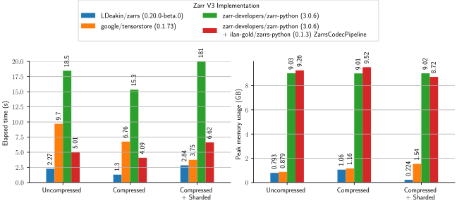

# Zarr Benchmarks

This repository contains benchmarks of Zarr V3 implementations.

> [!NOTE]
> Contributions are welcomed for additional benchmarks, more implementations, or otherwise cleaning up this repository.
>
> Also consider restarting development of the official zarr benchmark repository: https://github.com/zarr-developers/zarr-benchmark

## Implementations Benchmarked
- [`LDeakin/zarrs`](https://github.com/LDeakin/zarrs) v0.17.0 (Rust 1.81.0) via [`LDeakin/zarrs_tools`](https://github.com/LDeakin/zarrs_tools) 0.6.0 (4beba5f)
  - Benchmark executable (read): [zarrs_benchmark_read_sync](https://github.com/LDeakin/zarrs_tools/blob/main/src/bin/zarrs_benchmark_read_sync.rs)
  - Benchmark executable (round trip): [zarrs_reencode](https://github.com/LDeakin/zarrs_tools/blob/main/src/bin/zarrs_reencode.rs)
- [`google/tensorstore`](https://github.com/google/tensorstore) v0.1.67 (Python 3.12.5)
  - Benchmark script (read): [scripts/tensorstore_python_benchmark_read.py](./scripts/tensorstore_python_benchmark_read.py)
  - Benchmark script (round trip): [scripts/tensorstore_python_benchmark_roundtrip.py](./scripts/tensorstore_python_benchmark_roundtrip.py)
- [`zarr-developers/zarr-python`](https://github.com/zarr-developers/zarr-python) 3.0.0b1 (Python 3.12.5)
  - Benchmark script (read): [scripts/zarr_python_benchmark_read.py](./scripts/zarr_python_benchmark_read.py)
  - Benchmark script (roundtrip): [scripts/zarr_python_benchmark_roundtrip.py](./scripts/zarr_python_benchmark_roundtrip.py)
- [`zarr-developers/zarr-python`](https://github.com/zarr-developers/zarr-python) 3.0.0b1 (Python 3.12.5) with [`ilan-gold/zarrs-python`](https://github.com/ilan-gold/zarrs-python) `CodecPipeline`
  - Benchmark script (read): [scripts/zarrs_python_benchmark_read.py](./scripts/zarrs_python_benchmark_read.py)
  - Benchmark script (roundtrip): [scripts/zarrs_python_benchmark_roundtrip.py](./scripts/zarrs_python_benchmark_roundtrip.py)

> [!WARNING]
> Python benchmarks (`tensorstore` and `zarr-python`) are subject to the overheads of Python and may not be using an optimal API/parameters.
>
> Please open a PR if you can improve these benchmarks.

## `make` Targets
 - `pydeps`: install python dependencies (recommended to activate a venv first)
 - `zarrs_tools`: install `zarrs_tools` (set `CARGO_HOME` to override the installation dir)
 - `generate_data`: generate benchmark data
 - `benchmark_read_all`: run [read all](#read-all-benchmark) benchmark
 - `benchmark_read_chunks`: run [chunk-by-chunk](#read-chunk-by-chunk-benchmark) benchmark
 - `benchmark_roundtrip`: run [roundtrip](#round-trip-benchmark) benchmark
 - `benchmark_all`: run all benchmarks

## Benchmark Data
All datasets are $1024x1024x2048$ `uint16` arrays.

| Name                               | Chunk Shape | Shard Shape | Compression                 | Size   |
|------------------------------------|-------------|-------------|-----------------------------|--------|
| data/benchmark.zarr                | $256^3$     |             | None                        | 8.0 GB |
| data/benchmark_compress.zarr       | $256^3$     |             | `blosclz` 9 + bitshuffling  | 377 MB |
| data/benchmark_compress_shard.zarr | $32^3$      | $256^3$     | `blosclz` 9 + bitshuffling  | 1.1 GB |

## Benchmark System
- AMD Ryzen 5900X
- 64GB DDR4 3600MHz (16-19-19-39)
- 2TB Samsung 990 Pro
- Ubuntu 22.04 (in Windows 11 WSL2, swap disabled, 32GB available memory)

## Read All Benchmark
This benchmark measures the minimum time and and peak memory usage to read an entire dataset into memory.
 - The disk cache is cleared between each measurement
 - These are best of 3 measurements

[Table of raw measurements (benchmarks_read_all.md)](./measurements/benchmark_read_all.md)

## Read Chunk-By-Chunk Benchmark

This benchmark measures the the minimum time and peak memory usage to read a dataset chunk-by-chunk into memory.
 - The disk cache is cleared between each measurement
 - These are best of 1 measurements

 > [!NOTE]
 > `zarr-python` benchmarks with sharding are not visible in this plot

[Table of raw measurements (benchmarks_read_chunks.md)](./measurements/benchmark_read_chunks.md)

## Round Trip Benchmark

This benchmark measures time and peak memory usage to "round trip" a dataset (potentially chunk-by-chunk).
 - The disk cache is cleared between each measurement
 - These are best of 3 measurements

[Table of raw measurements (benchmarks_roundtrip.md)](./measurements/benchmark_roundtrip.md)
